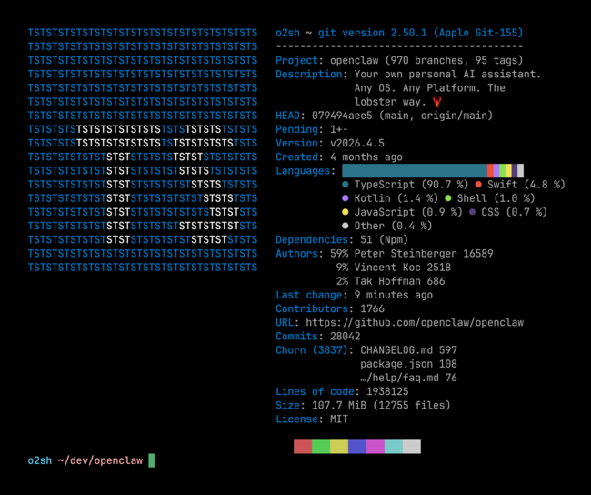
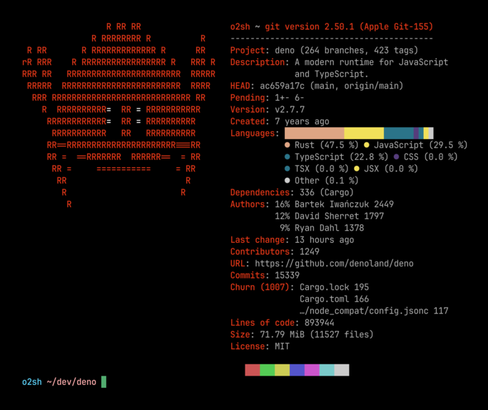

<div align="center">

# Onefetch - Command-line Git information tool

<p></p>

[](https://crates.io/crates/onefetch)
[](https://github.com/o2sh/onefetch/actions/workflows/ci.yml)
[](https://github.com/o2sh/onefetch/issues?q=is%3Aissue+is%3Aopen+label%3A%22help+wanted%22)


<h3>
<a href="https://onefetch.dev/">Homepage</a> |
<a href="https://github.com/o2sh/onefetch/wiki/Installation">Installation</a> |
<a href="https://github.com/o2sh/onefetch/wiki/">Documentation</a>
</h3>

</div>

---

Onefetch is a command-line Git information tool that displays project information and code statistics for a local Git repository directly in your terminal. The tool works completely offline with a focus on performance and customizability.

|                                          |                                          |
| ---------------------------------------- | ---------------------------------------- |
|  |  |

## Installation

Onefetch is available on Linux, macOS, and Windows platforms. Binaries for Linux, Windows, and macOS are available on the [release page](https://github.com/o2sh/onefetch/releases).

### Linux

- Ubuntu

  ```
  wget https://github.com/o2sh/onefetch/releases/latest/download/onefetch_amd64.deb && sudo dpkg -i ./onefetch_amd64.deb && rm onefetch_amd64.deb
  ```

- Arch Linux

  ```
  pacman -S onefetch
  ```

- openSUSE

  ```
  zypper install onefetch
  ```

### macOS

```
brew install onefetch
```

### Windows

```
winget install onefetch
```

## Usage

```
onefetch /path/of/your/repo
```

Or

```
cd /path/of/your/repo
onefetch
```

## Customization

Onefetch can be customized via [command-line arguments](https://github.com/o2sh/onefetch/wiki/command-line-options) to display exactly what you want, the way you want it: adjust the text styling, disable info lines, ignore files and directories, output in multiple formats (JSON, YAML), etc.

## Frequently Asked Questions

### Why isn't my language detected?

This is one of the most common questions! There are a few reasons why your language might not appear in onefetch's output:

#### 1. Language type filtering

By default, onefetch only displays **programming** and **markup** languages. Languages classified as **prose** (like Org mode, Markdown, or Text) or **data** (like JSON, YAML, or TOML) are hidden by default.

To include all language types, use the `--type` option:

```sh
# Show all language types
onefetch --type programming markup prose data

# Show only prose languages
onefetch --type prose
```

**Available language types:** `programming`, `markup`, `prose`, `data`

#### 2. Files are being ignored

Check if your files are being excluded by:

- `.gitignore` patterns
- The `--exclude` flag
- The `.tokeignore` file in your repository

#### 3. Language not supported by tokei

Onefetch uses [tokei](https://github.com/XAMPPRocky/tokei) for language detection. If tokei doesn't support your language, onefetch won't detect it either. Consider [opening an issue on tokei's repository](https://github.com/XAMPPRocky/tokei/issues).

#### 4. Number of languages limit

By default, onefetch only shows the top 6 languages. To show more:

```sh
onefetch --number-of-languages 10
```

### Why is the ASCII art different/missing?

Onefetch chooses ASCII art based on the dominant language. To display a specific language's art:

```sh
onefetch --ascii-language rust
```

### How do I customize the output?

Common customizations:

```sh
# Hide specific fields
onefetch --disabled-fields version created

# Change text colors
onefetch --text-colors 9 10 11 12 13 14

# Use a custom image instead of ASCII art
onefetch --image /path/to/image.png

# Output as JSON
onefetch --output json
```

## Contributing

Currently, onefetch supports more than [100 different programming languages](https://onefetch.dev); if your language of choice isn't supported, open an issue and support will be added.

Contributions are very welcome! See [CONTRIBUTING](CONTRIBUTING.md) for more info.
