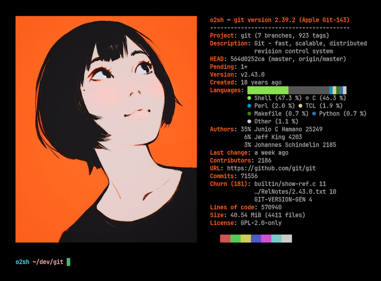

<h3 align="center"></h3>

<h5 align="center">Una herramienta de información de Git de línea de comandos escrita en Rust</h5>

	
	
  
	
	
	

Onefetch es una herramienta de información Git de línea de comandos escrita en `Rust` que muestra información del proyecto y estadísticas de código para un repositorio Git local directamente en su terminal. La herramienta funciona sin conexión a internet.

De manera predeterminada, la información del repositorio se muestra junto con el logotipo del lenguaje dominante, pero puede configurar onefetch para usar una imagen, en terminales compatibles, una entrada de texto o nada en absoluto.

Detecta automáticamente las licencias de código abierto de los textos y proporciona al usuario información valiosa como distribución de código, cambios pendientes, número de dependencias (por administrador de paquetes), principales contribuyentes (por número de confirmaciones), tamaño en disco, fecha de creación, LOC (líneas de código), etc.

Onefetch se puede configurar a través de indicadores de línea de comandos para mostrar exactamente lo que desea, de la manera que desea: puede personalizar el formato de texto/ASCII, deshabilitar líneas de información, ignorar archivos y directorios, salida en múltiples formatos (Json, Yaml), etc.

A partir de ahora, onefetch admite más de 100 lenguajes de programación diferentes;si el lenguaje de su elección no es compatible: abra una propuesta (issue) y se agregará soporte.

¡Las contribuciones son muy bienvenidas! Consulte [CONTRIBUTING](../CONTRIBUTING.md) para obtener más información.

### Más: \[[Wiki](https://github.com/o2sh/onefetch/wiki)\] \[[Instalación](https://github.com/o2sh/onefetch/wiki/Installation)\] \[[Para Empezar](https://github.com/o2sh/onefetch/wiki/getting-started)\]
