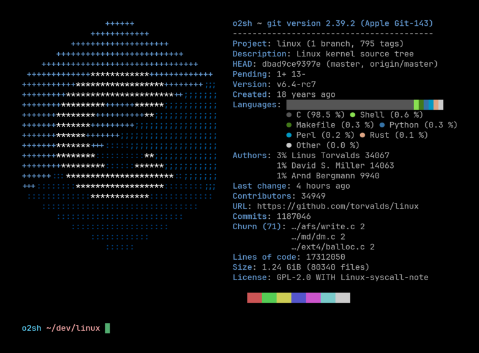

<h3 align="center"></h3>

<h5 align="center">Rust로 작성된 깃 정보 커맨드라인 유틸리티</h5>

    
    
  
	
    
    

Onefetch는 `Rust`로 작성된 깃 정보 유틸리티 입니다. Onefetch를 사용하면 네트워크 연결이 필요 없이 터미널에서 바로 로컬 깃 저장소의 프로젝트 정보와 코드 통계 등을 볼 수 있습니다.

기본적으로, 해당 저장소 정보와 함께 가장 많이 쓰인 프로그래밍 언어의 로고가 표시됩니다. 하지만 (만약 터미널이 지원한다면) 이미지, 원하는 텍스트, 또는 아무것도 표시하지 않도록 설정할 수도 있습니다.

Onefetch는 텍스트를 읽고 어떤 라이선스를 사용 중인지 자동으로 알아내며, 언어 종류, 대기중인 커밋, (패키지 관리자별) 의존성 갯수, 가장 많이 커밋한 기여자들, 총 용량, 만들어진 날짜, 총 코드 줄 수 등 다양한 정보를 보여줍니다.

또한 명령줄 인자를 통해 정확히 어떤 부분을 보여줄지 원하는 대로 설정할 수 있습니다. 예를 들어 텍스트 포맷을 변경하거나, 정보 칸을 표시하지 않거나, 특정 파일 또는 폴더를 무시하거나, Json또는 Yaml등 다양한 포맷으로 출력할 수 있습니다.

현재 onefetch는 [100개가 넘는 프로그래밍 언어들](https://onefetch.dev)을 지원합니다. 만약 여러분이 사용하는 언어가 포함되어있지 않다면 새 이슈를 열어주세요.

기여는 언제나 환영입니다! [CONTRIBUTING](../CONTRIBUTING.md)에서 더 자세한 내용을 확인해주세요.

### 더 알아보기: \[[Wiki](https://github.com/o2sh/onefetch/wiki)\] \[[Installation](https://github.com/o2sh/onefetch/wiki/Installation)\] \[[Getting Started](https://github.com/o2sh/onefetch/wiki/getting-started)\]
