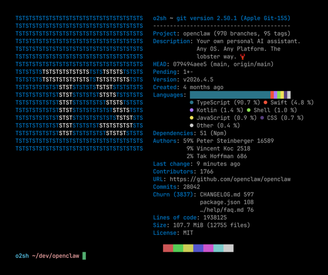

<h3 align="center"></h3>

<h5 align="center">Терминальная утилита для вывода информации о Git
репозиториях, написанная на Rust</h5>

	
	
  
	
	
	

Onefetch выводит информацию о локальном Git репозитории прямо в терминал.
Утилита не нуждается в подключении к интернету.

По умолчанию информация о репозитории отображается вместе с логотипом главного
языка программирования, но вы можете сделать так, чтобы Onefetch использовал
изображение (если терминал это позволяет), читал ваш собственный ASCII-рисунок
или вообще не выводил его.

Утилита автоматически обнаруживает OpenSource лицензии по их тексту и предоставляет
различную информацию, вроде языков программирования, из которых состоит
репозиторий, изменений, ожидающих подтверждения, числа зависимостей (по
пакетному менеджеру), главных контрибьюторов (по числу коммитов),
размера занимаемого места на диске, даты создания, количества строк и т.п.

Onefetch конфигурируется через флаги, позволяющие отображать только нужную вам
информацию, в нужном вам виде: вы можете менять форматирование текста,
выключать отображение определенных полей, игнорировать определенные файлы и директории,
выводить информацию в различных форматах (Json, Yaml) и т.д.

На данный момент Onefetch поддерживает более [100 языков программирования](https://onefetch.dev). Если
нужный вам язык не поддерживается, дайте нам об этом знать, мы добавим
его.

Вклады всегда приветствуются! Прочтите [CONTRIBUTING](../CONTRIBUTING.md),
чтобы узнать больше.

### Больше информации: \[[Wiki](https://github.com/o2sh/onefetch/wiki)\] \[[Установка](https://github.com/o2sh/onefetch/wiki/Installation)\] \[[Основы](https://github.com/o2sh/onefetch/wiki/getting-started)\]
